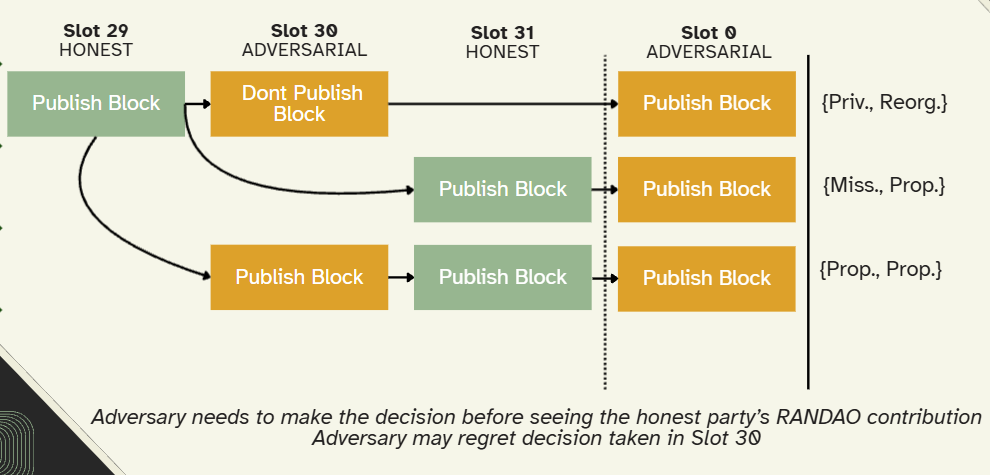
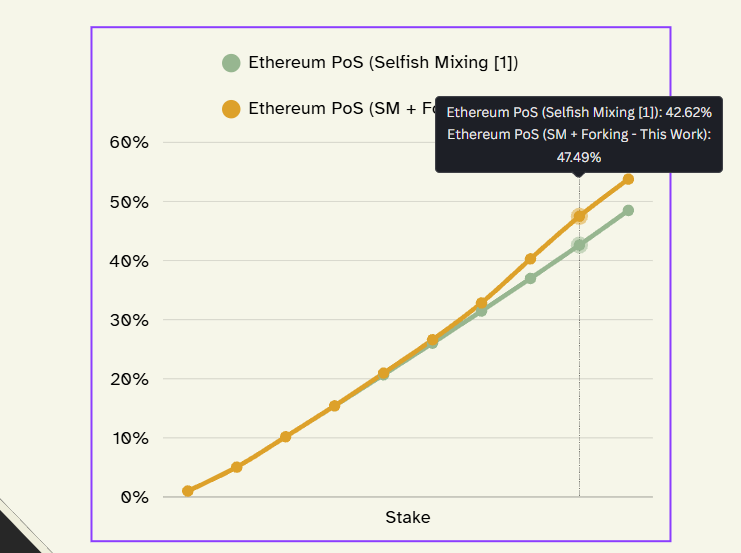

# Forking the RANDAO: Manipulating Ethereum's Distributed Randomness Beacon

## Executive Summary

This blog examines **"Forking the RANDAO: Manipulating Ethereum's Distributed Randomness Beacon"** (Nagy _et al._, 2025), a recent and influential study on Ethereum's consensus security. We chose this paper because it provides a deep, formal analysis of a new attack against Ethereum's randomness beacon, a core component of its proof-of-stake protocol. This attack ,called the *RANDAO forking* strategy ,augments previously known block-withholding (or "selfish mixing") tactics, significantly biasing the beacon and threatening fairness and reliability for users. We summarise the problem (Ethereum's RANDAO beacon can be manipulated), review related work on randomness attacks, and explain the paper's approach (an extended attack strategy analysed via Markov decision processes). We also discuss the paper's limitations (e.g. its dependence on large-stake adversaries and fixed protocol parameters) and how they might be addressed, including cryptographic fixes like verifiable random functions (VRFs) and delay functions (VDFs). Finally, we summarise the empirical findings: the authors searched years of Ethereum consensus data but found **no clear evidence** that anyone has yet exploited these strategies in the wild. We include a comparison table of related works and diagrams illustrating the attack and its results throughout.

---

## Problem Statement

Randomness is critical in proof-of-stake (PoS) blockchains for fair leader selection. Ethereum uses a *distributed randomness beacon* called **RANDAO**, in which each validator contributes a random value (by signing the current epoch number) and the results are XORed into a running mix. The final randomness output is used to assign future block-proposal slots. However, Ethereum's commit-reveal design has a **bias vulnerability**: if validators deliberately skip publishing in a slot (a "missed block"), they omit their contribution and can influence the beacon outcome. By withholding blocks at the end of an epoch ("tail slots"), a validator can skew the randomness to increase its chance of being chosen later. Prior work showed that large staking pools could exploit this *selfish mixing* strategy to win extra slots ,a 20% pool could gain roughly +0.7% more slots than their fair share.

**Forking the RANDAO** introduces a more aggressive twist. Instead of simply not publishing a block, an adversarial validator can attempt to *fork out* an honest block from the chain entirely, removing that block's randomness contribution while simultaneously capturing its transaction fees and rewards. This is substantially more damaging: it can roughly double the attacker's gain over selfish mixing alone, and it undermines chain reliability by discarding already-published transactions. In summary, Ethereum's current randomness beacon can be strategically manipulated by validators who omit or replace blocks, creating unfair advantage and eroding network trust.

---

## Related Work

Randomness manipulation in blockchain consensus has a reasonably long research history, and this paper sits at the end of a clear lineage.

<!-- DIAGRAM 1: Related Work Timeline -->
<!-- Placeholder: Insert a horizontal timeline graphic showing the progression:
     Eyal & Sirer (2014) → Wahrstätter (2023) → Alpturer & Weinberg (2024) → Nagy et al. (2025) → EIP-7998 (2025)
     Each node should briefly label the key contribution. -->

The earliest and most well-known analogue is **selfish mining** in proof-of-work Bitcoin, formalised by [Eyal & Sirer (2014)](https://arxiv.org/abs/1311.0243). They showed that a miner controlling ≥25% of hash power can earn disproportionate block rewards by strategically withholding newly mined blocks and releasing them to orphan honest miners' work. The core mechanism ,private chain building followed by strategic release ,is structurally similar to the RANDAO forking attack, though the target (randomness bias vs. pure revenue) and protocol context (PoW vs. PoS) differ considerably.

In the Ethereum PoS context, the first serious treatment of RANDAO manipulation came from a 2023 Ethereum Research forum post by [Wahrstätter ("Selfish Mixing and RANDAO Manipulation")](https://ethresear.ch/t/selfish-mixing-and-randao-manipulation/16081). Wahrstätter quantified how strategically missing tail slots could shift the RANDAO output and reassign future block proposals. Using simulations and historical beacon chain data, he showed that major pools like Lido had encountered dozens of realistic opportunities to bias RANDAO. This was an important empirical contribution, though the post was informal and did not optimise the attack strategy.

[Alpturer & Weinberg (2024)](https://drops.dagstuhl.de/entities/document/10.4230/LIPIcs.AFT.2024.10) formalised selfish mixing as a Markov Decision Process, computing the theoretically optimal withholding strategy for any stake fraction α. Their key findings: a 20% staker gains roughly +0.68% additional proposals; a 10% staker gains about +0.19%. They also showed repeated manipulation misses ~0.3% of slots, slightly reducing chain throughput. Importantly, their model is restricted to block withholding only ,forking out honest blocks was explicitly out of scope.

[Nagy et al. (2025)](https://eprint.iacr.org/2025/037) is the first work to study forking attacks on RANDAO directly. They extend the MDP framework of Alpturer & Weinberg to cover cross-epoch attack strings and introduce the forking strategy as a formal object of study. On the fix side, [EIP-7998 (2025)](https://eips.ethereum.org/EIPS/eip-7998) is a draft Ethereum protocol proposal that would convert `randao_reveal` into a per-slot BLS-based VRF, directly eliminating the bias vector this paper identifies.

The table below summarises the key papers:

| **Paper** | **Year** | **Method** | **Key Result** | **Limitation** |
|---|---|---|---|---|
| [Wahrstätter](https://ethresear.ch/t/selfish-mixing-and-randao-manipulation/16081) (Ethereum Research) | 2023 | Data analysis, simulation | Showed large pools could bias RANDAO by selfish mixing; e.g. Lido had opportunities to gain extra slots. | Informal forum post; not a formal model; no attack optimisation. |
| [Alpturer & Weinberg](https://drops.dagstuhl.de/entities/document/10.4230/LIPIcs.AFT.2024.10) | 2024 | MDP optimization | Formulated selfish-mixing as MDP; found 20% stake → +0.7% block gain via optimal withholding. | Only covers withholding; ignores forking attacks. |
| [Nagy et al.](https://eprint.iacr.org/2025/037) (this paper) | 2025 | MDP + new attack | Introduced "forking" strategy; doubling bias when combined with selfish mixing; e.g. 28.1% stake → +8.37%. | Requires ≥20% stake and favorable slot pattern; complex cross-epoch state. |
| [EIP-7998](https://eips.ethereum.org/EIPS/eip-7998) (proposed fix) | 2025 | Protocol upgrade (VRF) | Use per-slot BLS-VRF instead of simple RANDAO, eliminating the bias vector. | Draft proposal (hard fork needed); implementation and upgrade timeline uncertain. |
| [Eyal & Sirer (Bitcoin)](https://arxiv.org/abs/1311.0243) | 2014 | Analysis + simulation | Selfish mining in PoW: ≥25% hash power → disproportionate block rewards. | Applies to PoW, not PoS. |

The clearest takeaway from this lineage is that Nagy et al.'s forking attack is not an isolated discovery ,it is a direct extension of the selfish mixing line of work, and combining the two strategies yields significantly higher gains than either alone.

---

## Proposed Solution (Attack and Analysis)

Nagy et al. do not propose a protocol fix ,their main contribution is the *attack strategy itself* and its formal analysis. The core idea involves a specific slot arrangement the authors denote **AH·A**: the adversary is scheduled to propose the last slot of epoch *e*, an honest validator proposes the slot immediately before the epoch boundary, and the adversary is again scheduled first in epoch *e+1*.

Under this arrangement, the adversary secretly builds their own block for slot 30 without broadcasting it, lets the honest validator publish at slot 31, then at the epoch boundary releases their private fork of two blocks, orphaning the honest block. The honest block's RANDAO contribution is stripped from the canonical chain. Crucially, because Ethereum uses LMD-GHOST fork-choice with a *proposer boost*, the adversary's branch wins the fork provided they hold ≥20% stake. The adversary therefore gains twice: they manipulate future leader selection *and* capture the MEV and fees from the orphaned honest block.

The authors formalise this using a **Markov Decision Process (MDP)**. Each MDP state represents the current "attack string" ,the sequence of adversarial (A) and honest (H) slots seen in an epoch. The adversary's actions at each state are to publish or withhold, and in the forking case, to build a competing private chain. Transition probabilities are governed by stake fraction α; the reward function counts slots ultimately controlled by the adversary.

Because the forking attack spans an epoch boundary, the authors extend the standard MDP to what they call an **extended attack string**, requiring the adversary to evaluate RANDAO outcomes across two consecutive epochs simultaneously. This substantially expands the state space, which they manage through state-space reductions and approximate policy iteration.

Numerically, their results show:

- A **28.1% staker** can increase effective slot share from 28.1% to approximately **36.5%** under the combined selfish-mixing + forking strategy ,an excess gain roughly double that of selfish mixing alone.
- A **40% staker** reaches ~47.5% effective share, compared to ~42.6% under selfish mixing alone.
- Even at **45% stake**, Ethereum remains less biasable than Bitcoin's PoW selfish mining (53.78% vs ~70% effective share).

---

## Gaps and Limitations

The paper is thorough, but several aspects warrant scrutiny.

**The ≥20% stake requirement is a significant constraint.** The attack is only practically relevant for the very largest staking pools. While Lido clearly meets that threshold, this is not a systemic threat that affects the broader validator population. The paper could be more explicit about who the realistic threat actors are and what concentration of stake is actually required in practice under different slot-ordering probabilities.

**Global optimality cannot be guaranteed.** The authors explicitly acknowledge that proving global optimality of their MDP strategies is infeasible due to state space size. The reductions and approximations they employ are reasonable, but it remains possible that a more damaging strategy exists and was not discovered. The computed gains should therefore be treated as lower bounds on worst-case manipulation, not upper bounds.

**The rational actor assumption is idealized.** The model assumes validators are purely profit-maximising agents. In practice, large stakers like Lido operate under significant reputational and regulatory constraints. Being detected manipulating RANDAO would likely be commercially catastrophic. The paper does not model this reputational risk, which may substantially change the real-world incentive calculus.

**The analysis is Ethereum-specific.** It presumes LMD-GHOST fork choice with proposer boost and a fixed 12-second slot time. Protocol changes, even modest ones like adjusting epoch length or proposer boost weight ,could materially alter the results. The paper does not evaluate sensitivity to these parameters in depth, and findings may not transfer to other PoS systems or future Ethereum upgrades.

**The empirical section has limited inferential power.** The finding of no detected manipulation is valid, but it cannot distinguish between four possible explanations: the attack is too complex to execute reliably; validators are behaving honestly; the reputational risk outweighs the gain; or manipulation is occurring but is undetectable with the methods used. This ambiguity limits what conclusions can be drawn from the empirical null result.

---

## Bridging the Gaps

The cleanest resolution to the bias problem is a **cryptographic redesign** of the randomness beacon. [EIP-7998](https://eips.ethereum.org/EIPS/eip-7998) addresses this directly by converting `randao_reveal` into a per-slot BLS-based VRF: instead of signing only the epoch number, proposers sign a container holding the previous epoch's RANDAO mix and the current slot number. This makes each reveal unpredictable even to the proposer themselves, eliminating the bias window entirely and enabling Single Secret Leader Election (SSLE) as a downstream benefit. The proposal requires a hard fork, which introduces coordination and timeline uncertainty, but represents the most complete fix available.

Verifiable delay functions (VDFs) offer a complementary approach: by forcing the randomness output to be finalised only after a mandatory computation delay, late omissions cannot affect the outcome. The practical challenge is that current VDF constructions do not scale to Ethereum's validator set without centralised or trusted computation infrastructure.

Shorter-term mitigations discussed in the literature include penalising missed tail slots more aggressively, increasing the proposer boost to make forking harder, or extending epoch length to reduce the frequency of exploitable slot patterns. None of these fully close the attack surface, but they could raise the cost and reduce the frequency of successful exploitation while a protocol-level fix is implemented.

The [forking_randao_manipulation](https://github.com/nagyabi/forking_randao_manipulation) repository released alongside the paper provides detection tooling that can flag anomalous slot behaviour on mainnet, offering an operational monitoring layer in the interim.

---

## Empirical Evidence

Nagy et al. validate their analysis against Ethereum beacon chain data covering September 2022 to October 2024. They identify all epochs where large pools held consecutive tail slots, the prerequisite for both selfish mixing and forking attacks, and test whether those pools' observed behaviour deviates from the honest baseline.

For Lido - the largest pool at ~28% stake - there were 737 epochs with four consecutive tail slots, representing 737 opportunities to execute a selfish mixing or forking strategy. Of those, Lido missed at least one tail slot in only 3 cases. Across all major pools examined, the authors find no statistically significant deviation from honest behaviour. RANDAO output values in epochs where manipulation was possible do not skew toward "BEST" outcomes more than chance would predict.

The paper's conclusion is clear: *"Our empirical measurements… revealed no statistically significant traces of these attacks to date."* Whether this reflects genuine honesty, insufficient incentive, fear of detection, or operational difficulty remains an open question, but it does suggest the theoretical risk has not yet translated into practice.

For broader context, the authors also compare Ethereum's manipulability to Bitcoin's PoW selfish mining at equivalent resource shares. Ethereum's combined selfish-mixing and forking attack produces lower effective-stake gains than Bitcoin selfish mining across all tested stake levels, suggesting Ethereum's beacon, while imperfect, is not the worst-case design in the landscape.

Please also view the [Presentation](https://canva.link/7zo6votgar1f03d) visualizing the paper.

---

## References

- Nagy, Á., Tapolcai, J., Seres, I. A., & Ladóczki, B. (2025). *[Forking the RANDAO: Manipulating Ethereum's Distributed Randomness Beacon](https://eprint.iacr.org/2025/037)*. IACR ePrint 2025/037.
- Alpturer, K., & Weinberg, M. (2024). *[Optimal RANDAO Manipulation in Ethereum](https://drops.dagstuhl.de/entities/document/10.4230/LIPIcs.AFT.2024.10)*. In *Advances in Financial Technologies (AFT 2024)*.
- Wahrstätter, T. (2023). *[Selfish Mixing and RANDAO Manipulation](https://ethresear.ch/t/selfish-mixing-and-randao-manipulation/16081)*. Ethereum Research Forum.
- EIP-7998 (2025). *[Turn `randao_reveal` into a VRF](https://eips.ethereum.org/EIPS/eip-7998)*. Ethereum Improvement Proposals.
- Eyal, I., & Sirer, E. (2014). *[Majority is not Enough: Bitcoin Mining is Vulnerable](https://arxiv.org/abs/1311.0243)*. Financial Cryptography and Data Security, FC 2014.
- Nagy, Á., et al. (2025). *[forking_randao_manipulation](https://github.com/nagyabi/forking_randao_manipulation)*. GitHub repository.
